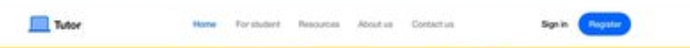
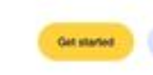
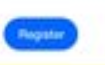
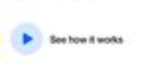

# React + Vite

This template provides a minimal setup to get React working in Vite with HMR and some ESLint rules.

Currently, two official plugins are available:

- [@vitejs/plugin-react](https://github.com/vitejs/vite-plugin-react/blob/main/packages/plugin-react/README.md) uses [Babel](https://babeljs.io/) for Fast Refresh
- [@vitejs/plugin-react-swc](https://github.com/vitejs/vite-plugin-react-swc) uses [SWC](https://swc.rs/) for Fast Refresh

## TAREA 26/02/24
Plantear la maquetación para el landing page: https://i.pinimg.com/564x/06/63/99/066399ec6b9d35460ef1e329d36b5e38.jpg

# NavBar (Desde el logo hasta el boton de Registrar )

# Btn (los botones de Registrar, y GetStarted) - Varia solamente el color entre estos

# TagTitleText (Includes the orange tag, the title and the text)

# BtnVideo (See how it works button)

# CardRecord (1 componente repetido 4 veces, con información de records actualizados)

# BenefitCompt (1 componente repetido 4 veces, con beneficios que pueden cambiar)

# SubjectCompt (1 componente repetido 8 veces, con los temas más populares)

# Testimonial (1 componente que jala información de servidor para la imagen y texto, y que puede cambiar de persona)

